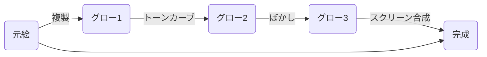

# Glow_Effect
イラストの仕上げのグロー効果を自動でつけるやつです。

ちょっと雰囲気柔らかくしたいなってときに。

 

```
./glow_effect.py image.jpg
```

とすれば効果が適用された画像が "image_out.jpg" のように保存されます。　元イメージ名は何でも良いです。 png も可です。

## 仕組み
デジ絵でよく知られた、

をやってます。

## オプション
```
usage: glow_effect.py [-h] [--suffix SUFFIX] [--quality QUALITY]
                      [--tone_curve_threshold TONE_CURVE_THRESHOLD]
                      [--tone_curve_delta TONE_CURVE_DELTA]
                      [--glow_bulr_size GLOW_BULR_SIZE]
                      [--glow_bulr_angle GLOW_BULR_ANGLE]
                      [--glow_strength GLOW_STRENGTH]
                      [--orig_gamma ORIG_GAMMA]
                      [--orig_brightness ORIG_BRIGHTNESS]
                      [--orig_color ORIG_COLOR] [--rgb_delta RGB_DELTA]
                      [--rgb_angle RGB_ANGLE] [--jpeg_quality JPEG_QUALITY]
                      file_name
```
### suffix (デフォルト: _out)
アウトプットファイル名の末尾です。

### quality (デフォルト: 85)
出力のjpg圧縮クオリティです。

### tone_curve_threshold (デフォルト: 0.9)
トーンカーブのグロー効果部のスレッショルドです。 明るさ (0-1) のどこから先を光らせるかを指定します。
|||
|:---:|:---:|
|0.5|0.95|

### tone_curve_delta (デフォルト: 0.04)
トーンカーブ急峻さです。小さいほど急峻になり、グローがくっきりします。
|||
|:---:|:---:|
|0.001|0.2|

### glow_bulr_size (デフォルト: 0.4)
グローのぼかし幅です。縦、横狭い側に対する%を指定します。
|||
|:---:|:---:|
|0.1|2.0|

### glow_bulr_angle (デフォルト: None)
異方性ぼかしを適用したい場合に、角度を指定します。 指定がなければ通常のガウスぼかしです.
異方性ぼかしフィルタはPillowの標準機能じゃないので遅いです。

|||
|:---:|:---:|
|None|45|

分かりづらいですが、＼ の方向の線に強くグローが入ります。

### glow_strength (デフォルト: 0.8)
そのままの意味です。 RGB 別々に指定することも出来ます。

||||
|:---:|:---:|:---:|
|0.5|1.5|"1.0 0.5 0.5"|

### orig_gamma, orig_brightness, orig_color (デフォルト: 1.0)
スクリーン合成前のオリジナルイメージのガンマ値、輝度、彩度の調節パラメータです。
デフォルトでは何もしません。

### rgb_delta, rgb_angle (デフォルト: 0.0, 45)
グロー効果のR,G,Bをそれぞれずらします。 rgb_delta は縦、横狭い側に対する % を指定し、 rgb_angle でずらし角を指定します。

|||
|:---:|:---:|
|delta=0|delta=1.0, angle=-45|
