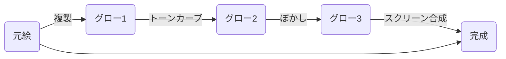

# Glow_Effect
イラストの仕上げのグロー効果を自動でつけるやつ.

 

```
./glow_effect.py image.jpg
```

とすれば効果が適用された画像が "image_out.jpg" のように保存されます。　元イメージ名は何でも良いです。 png も可です。

## 仕組み
デジ絵でよく知られた、

```mermaid
flowchart LR
    id1(元絵) -- 複製 --> id2(グロー1) -- トーンカーブ -->  id3(グロー2) -- ぼかし --> id4(グロー3) -- スクリーン合成 --> id6(完成)
    id1(元絵) --> id6
```
をやってます。
